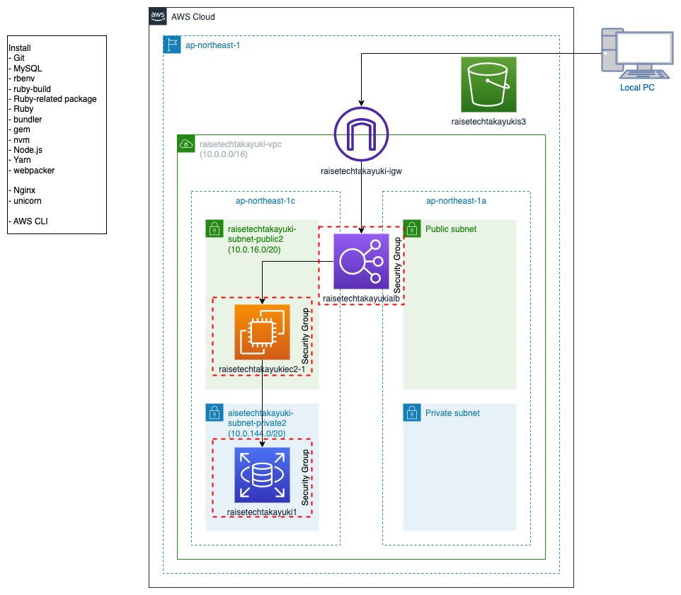

# RaiseTech AWSコース学習内容
# 1. Ruby on Railsサンプルアプリケーションのデプロイ
## 概要
- 名前と画像をリストアップするサンプルアプリケーションの環境を構築しました。
- EC2でサンプルアプリケーションを作動。WebサーバーとしてNginx, APサーバーとしてunicornを使用しました。
- DBはRDS for MySQL, 画像保存はS3, アクセスはELBを通す構成です。

 

# 2. CircleCIによるインフラ構築の自動化
## 概要
- CircleCIで以下のWorkflowを実行するリポジトリを作成しました。

## Workflow
1. GitHubのリポジトリにコードをPush
2. CircleCIで以下Pipelineを実行
    - CloudFormationのテンプレートチェック
    - CloudFormationでEC2を作成
    - AnsibleでEC2にGitをインストール
    - ServerSpecでGitのインストールをテスト

## 構成図

## 環境
### aws-cli
    $ aws --version
    aws-cli/2.9.18 Python/3.9.11 Linux/5.15.0-1021-aws exe/x86_64.ubuntu.22 prompt/off  
### Ansible
    $ ansible --version  
    ansible [core 2.11.12]  
    python version = 2.7.18 (default, Apr 20 2020, 19:39:49) [GCC 6.3.0 20170516]  
    jinja version = 2.11.3

### Ruby
    $ ruby -version  
    ruby 2.7.7p221 (2022-11-24 revision 168ec2b1e5) [x86_64-linux]

