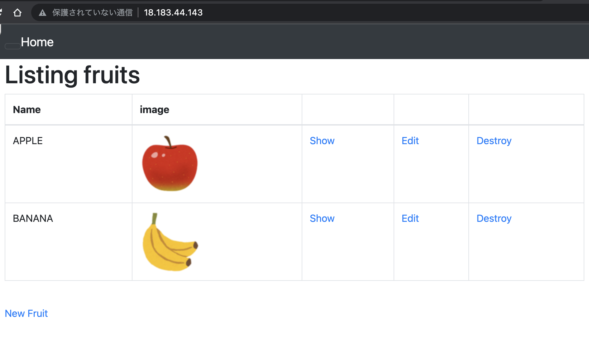
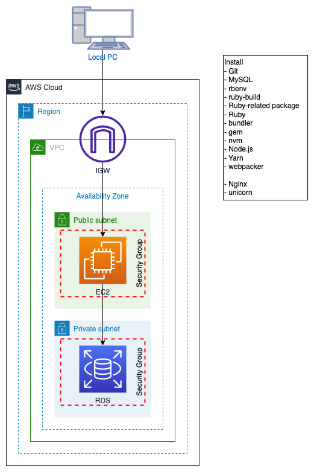
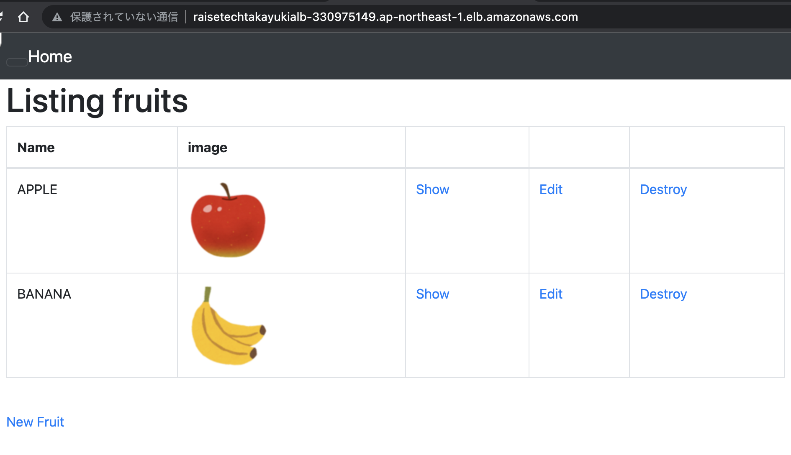
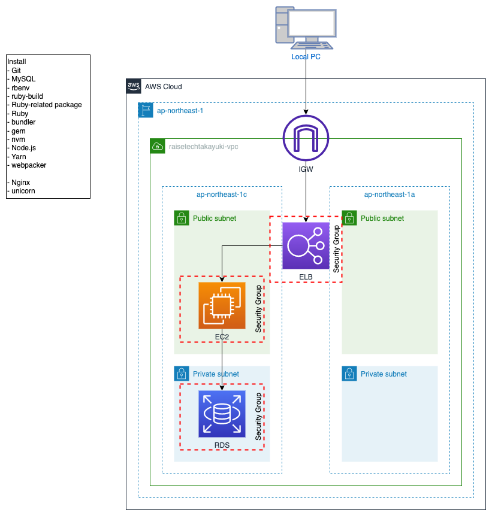
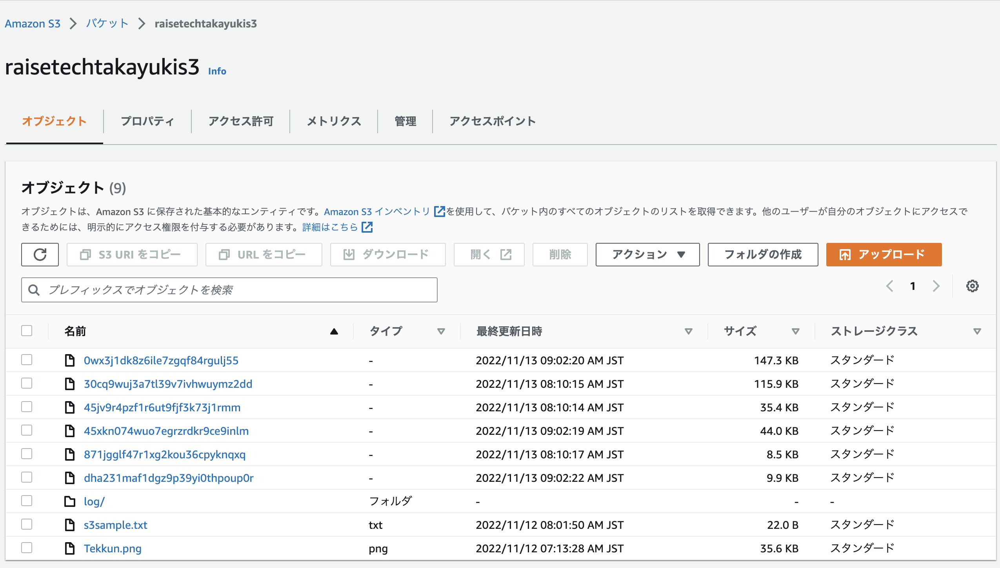
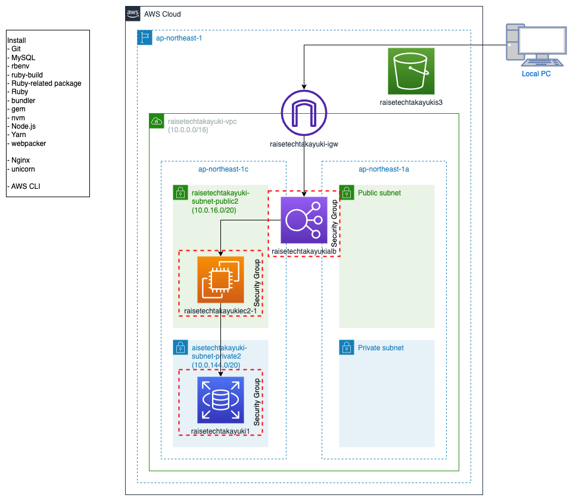

# 第5回 EC2上でアプリケーションをデプロイ
## 課題
1. 組み込みサーバーPumaのままデプロイ

2. unicorn-Nginxでデプロイ

3. ELB追加

4. S3追加

## 感想
- どのパッケージを選ぶかどう判断するかはまだ謎が残る。特に自動化の時にバージョンチェックを柔軟にできるのかイメージがつかない。
- 最新状態に保つのではなく、動くとわかっているバージョンに揃えることが大事。
- MySQLを起動した状態ではメモリ不足でgemのインストールができなかった。十分なスペックを確保する、または必要以上にメモリなどのスペックを消費しない発想が大事。
- sockが/homeにあると502 Bad Gatewayのエラーになり、/varにあると解消された。/home/ec2-user内にsockがあると権限エラーを起こす裏ロジックでもあるんだろうか。これも謎が残る。
- ImageMagickのインストールはコマンドで大文字じゃないとダメだった。そういうタイプもあるのか。
- CORS関連のエラーを特定するのに検証ツールのコンソールがとても役に立った。
- 家の外から違うIPアドレスで接続してみるのも良い復習になった。
- 記憶が新鮮なうちにリポジトリのアップデートに挑戦したいがぐちゃぐちゃになる予感しかしない。

