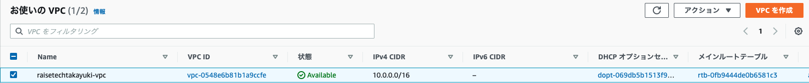
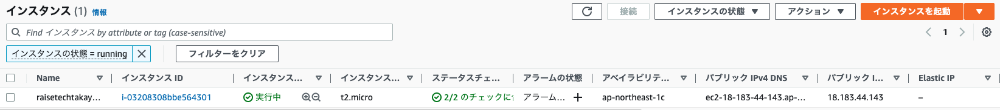
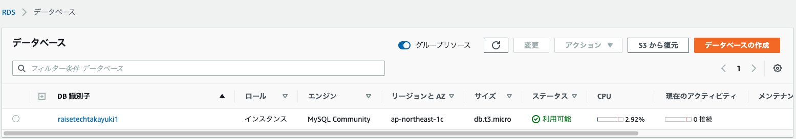
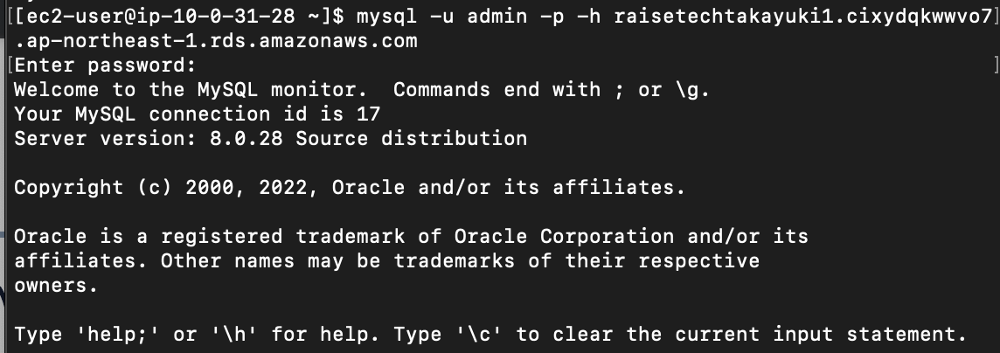

# 第4回講義
## 課題
1. VPC作成

2. EC2インスタンス作成

3. RDS作成

4. EC2-RDS接続

## 感想
- 詰まって、調べて、また詰まって、また調べて、結局作り直して、のループ。先が見えないのはツラい。
- さっさと聞いてしまわないと諦めたくなってしまいメンタルにも悪い。
- MySQLの接続で行き詰まり、ソケット問題かと思いきやバージョン違いの問題。過去にやったことでも内容を理解していないと全く応用が効かないことを痛感。自分で調べて自分で血肉にしていく他ない。
