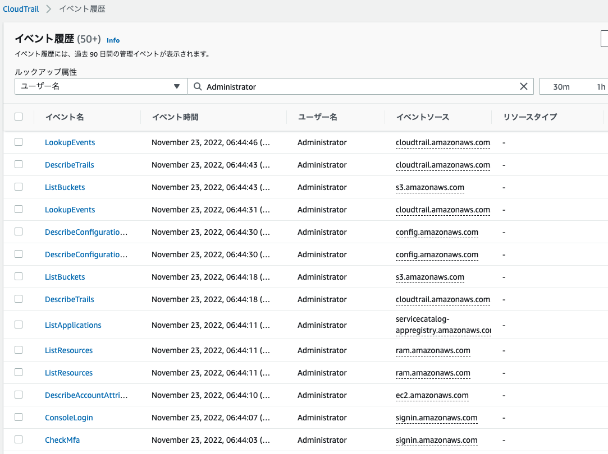
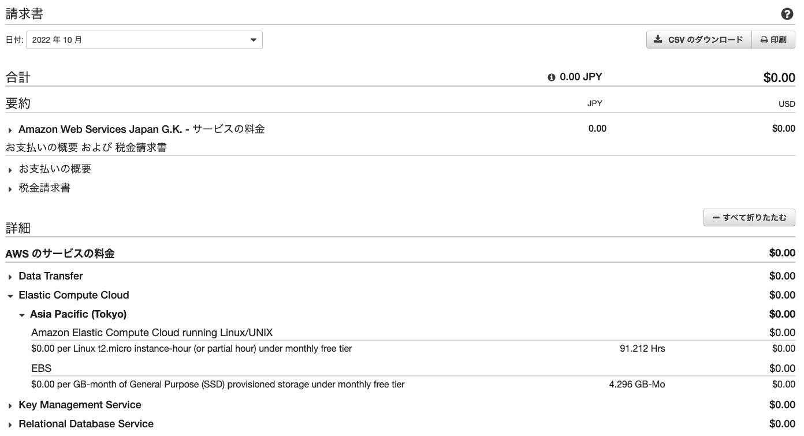

# 第6回 ロギング
## 課題
1. CloudTrailでAdminのイベント履歴を確認
ログインからCloudTrailで検索するまで

2. CloudWatchアラームでメール通知
unicornを止めるとAlarm

unicornを再度起動するとOK

3. AWS pricing calculatorで見積取得
1ヶ月46.29 USD
年間554.23 USD
[見積リンク](https://calculator.aws/#/estimate?id=edf8d480d355c4f362fa29467cecfb3e2f87df41)

4. Billingで請求書を確認
全てFree tier枠内

## 感想
- 第5回のアプリケーションデプロイやリポジトリアップデートに比べてとても平和に終わった。
- ログの取り方、見方、その体制についてインフラエンジニアが誰よりも理解していなければならない。
- USDなので円安はお財布に響く。
- ログインからの1分間だけでCloudTrailに多数のイベント履歴が記録されていた。情報の海を読み解いていくスキルが必要。まさにコナン君。
- 見積取得してみると、チュートリアルのようなセットアップなのに月7000円を超えており驚いた。高いと思ったがオンプレミスと比べるとめちゃくちゃ安い？どう捉えたらいいんだろう。
- 料金を抑えるためには、セットアップを必要以上に広げたままにしない、不要な時に稼働させない、がポイントだと思った。
