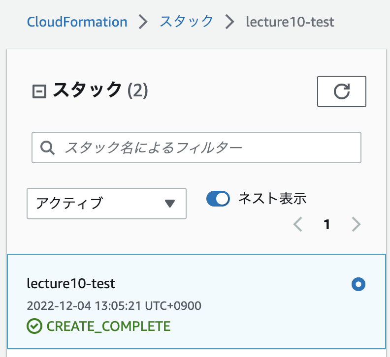

# 第10回 CloudFormation
## 課題
### CloudFormationでこれまでの環境をコード化
スタック生成を確認  
コードはtemplate_VPC-EC-RDS-ELB-S3.ymlに記載

  
## 疑問
- 結局ひとつのテンプレートで完結させてしまいましたが、現場ではどの粒度でテンプレートを分けていくことが多いのでしょうか？  
- セキュリティグループについて、ALB-EC2間のALB側のInbound設定や、EC2-RDS間のEC2側のInbound設定をしていないとふと思いました。  
それぞれEC2からALBへのInbound, RDSからEC2へのInboundと捉えていましたが、ここにはなぜ設定がいらないのでしょうか？  
レスポンスだからInboundではないということでしょうか？
- 講義でElastic IPも設定したらいい、とあった気がしますが、課題の範囲内ではEIPの良さを感じていません。  
ELBを使っている限りいらない気がするのですが、どのような場面で必須になるのでしょうか？
- CloudFormationでのS3作成でリージョン設定をしなかったのですがap-northeast-1で作成されました。  
どこかに紐付けた覚えはないのですが何を認識したのでしょうか？

## 感想
- パズルだしプラレールだしピタゴラスイッチ。確実に好きな分野。
- VSCodeを初めて触ったが見やすくて感動。スニペットも天才で感動。
- パッと見パラメーターの意味が分からなすぎる。毎回定義と例を確認しないと理解できないし、設定すべきなのか無視して良いのか見分けがつかない。
- IAM user, role, policy, InstanceProfileの仕組みが想像していたより奥深かった。
- エラーが次から次へと出たり、スタックの削除が止まってしまったり、CloudFormationのコンソール周りも勉強になった。
