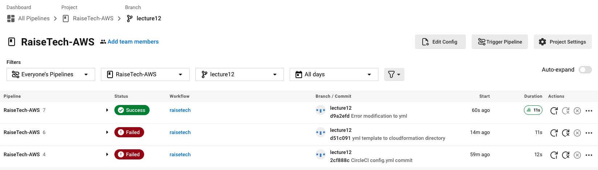
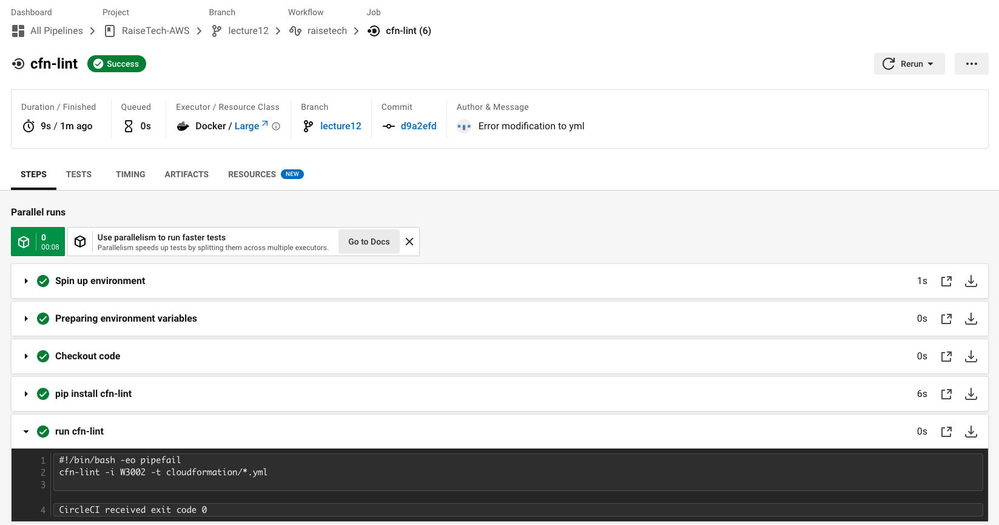

# 第12回 TerraformationとCI/CDツールCloudFormation
## 課題
### CircleCIサンプルコンフィグの導入
config.ymlの差し替え、clouldformation/*.ymlのエラー解消後

## 疑問
- 特になし

## 感想
- DevOpsについて、カバーしたい範囲は無限にある。まずはDevとOpsを両方気にかけるマインドから。
- cfn-lintのようにソースを外付けするとロジックの理解がすぐに追いつかなくなると思う一方、その繰り返しで進歩してきたのだなとも思う。
- CircleCIのローカルCLIのインストールで遂にHomebrewが発動。Homebrewなくてもやっていけそうだが、ググったときにbrewコマンドで済ませている情報が多いのでやっぱり使った方が楽かもしれない。
