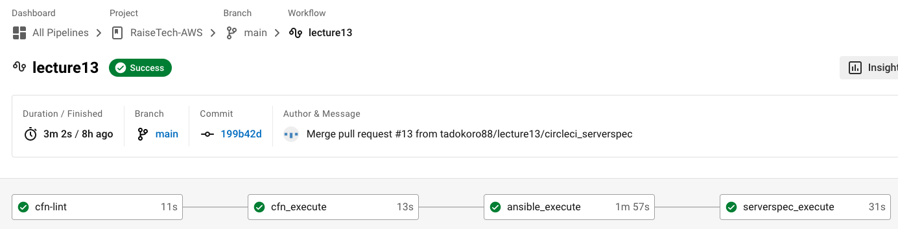
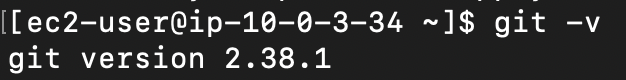
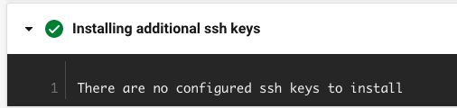
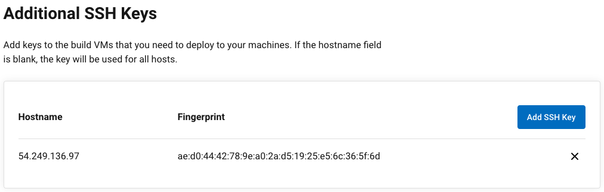
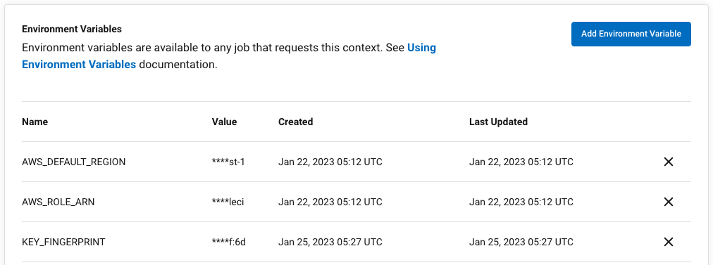
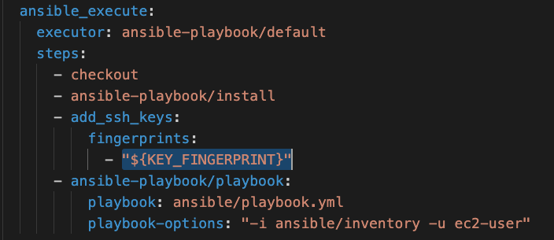
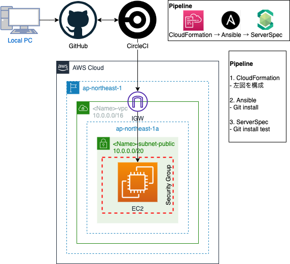

# 第13回 構成管理ツールとCI/CDツールの併用
## 課題
### CircleCIにCloudFormation, Ansible, ServerSpecを追加
- 方針
    - <u>CloudFormation</u>でAnsibleターゲットノード用のEC2をセットアップする。
    - ローカルで<u>Ansible</u>を実行してEC2にGitをインストールする。
    - ローカルで<u>ServerSpec</u>を実行してEC2のGitインストールをテストする。
    - ローカルからGitHubにコードをPushした時に上記が<u>CircleCI</u>で自動で実行されるようにする。
- CloudFormationのセットアップ
    - cfn_ansible.ymlの作成、実行
        - VPC, IGW, AttachIGW
        - PublicSubnet, RouteTable, Route, RouteTableAssoc
        - EC2SG, KeyPair, EC2, EIP, EIPAssoc
        - 第10回で作成したTemplateを参考に構成
    - EC2に接続
        - AWS Systems ManagerからKey Pairを取得してローカル保存
        - ローカルからEC2にSSH接続できることを確認
- Ansibleのセットアップ
    - インストール
        - Homebrew経由のPyenv経由のPython経由のAnsible
    - Inventoryの作成
        - EC2のEIPを指定
    - Playbook.ymlの作成
        - まずはGit presentのみ
    - `ansible-playbook`の実行
- ServerSpecのセットアップ
    - 初期セットアップ
        - Gemfileにgem "serverspec"を記載して`bundle install`
        - `serverspec-init`でEC2のEIPを入力
    - sample_spec.rbを編集
        - Git should be installed
    - SSH接続設定
        - ~/.ssh/configにターゲット情報を記述
    - `bundle exec rake spec`の実行
- CircleCIのセットアップ
    1. CloudFormation
        - OpenID Connect tokenの設定
            - IAM IDプロバイダー、IAM Roleの作成
            - CircleCIでAWS_ROLE_ARNを環境変数に登録
        - circleci/config.ymlの記述
            - aws-cliのインストール
            - assume-role-with-web-identityでTemporary tokenの発行、認証
            - CloudFormationの実行
    2. Ansible
        - circleci/config.ymlの記述
            - add_ssh_keys
            - Ansibleのインストール
            - Playbookの実行
        - SSH接続設定
            - CircleCIにターゲットノード接続用の秘密鍵を登録
            - FingerprintをCircleCIの環境変数として登録
            - ansible.cfgを作成しStrictHostKeyCheckを回避
        - (CircleCI上でのデバッグ)
            - GitHubにローカルの公開鍵を登録
            - CircleCIでRerun Job with SSHを実行
            - ローカルで秘密鍵を用いてCircleCIのDocker imageに接続
    3. ServerSpec
        - Gemfileの設定
            - serverspec, rake, ed25519, bcrypt_pbkdf
            - `bundle install`
        - circleci/config.ymlの記述
            - Gemのインストール
            - `bundle exec rake spec`
        - SSH接続設定
            - CircleCIにホスト名を環境変数として登録
            - spec_helper.rbで実行ユーザーを指定

CircleCIでのSUCCESSを確認

ターゲットノードでのGitインストールを確認

## 疑問
- CircleCI実行時にAnsibleのadd_ssh_keysが明らかに失敗しています。  
CircleCI上で環境変数"KEY_FINGERPRINT"を設定し、config.ymlで"${KEY_FINGERPRINT}"と呼び出しているのに認識されない理由は何か考えられますでしょうか？  
Fingerprintをベタ打ちで入れるとssh keyはインストールされるため、問題は変数の読み込みにあると思われます。  
凡ミスのような気もしますが手掛かりが掴めず、、  
またAdditional SSH Keyとして登録すればInventoryに記載したホスト名を探して読み込んでくれるようなので、ssh keyがインストールされなくても認証自体には成功しています。  

    CircleCI上でJobは成功しているもののssh keyがインストールできていない  
    
      

    CircleCIにAdditional SSH KeyとEnvironment Variable "KEY_FINGERPRINT"を登録済み
    
      
    
    circleci/config.ymlでKEY_FINGERPRINTの読み込みを指示
    

## 感想
- Gitをインストールするだけなのにとても時間がかかった。
- CircleCIでaws-cliのインストールに成功したのに、ローカルにもターゲットにもインストールされていなくてどういうこと？ → Docker image上にインストールしたから。  
Docker imageのホームディレクトリにAnsibleのInventoryやPlaybookが見つからないのはなぜ？ → projectの中にコピーされているから。  
などDockerの知識がないためにハマってしまった。勉強になったので良かったと言えば良かったのですが、講義でここの仕組みについてもう少し触れて欲しかったとは思いました。
- サンプルアプリケーションのデプロイまでの自動化は資格勉強を進めてから考えます。  

## 構成図

